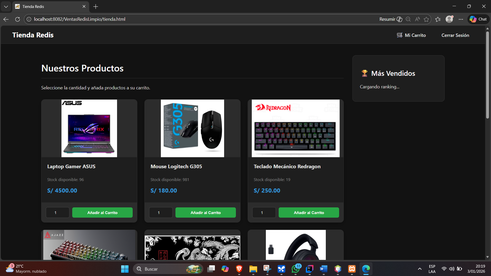

# Tienda Virtual High-Performance (Java Servlets + Redis) ⚡

### 📋 Descripción
Sistema de comercio electrónico desarrollado bajo arquitectura **MVC Monolítica**. El proyecto se enfoca en la optimización extrema de tiempos de carga utilizando **Redis** como caché y **WebSockets** para interactividad.

![Login Screen] screenshots/image.png

### 🚀 Stack Tecnológico
*   **Backend:** Java EE (Servlets, Filters, WebSockets).
*   **Base de Datos:** MySQL (Persistencia) + **Redis** (Caché en RAM).
*   **Librerías:** Jedis (Cliente Redis), Gson (JSON), JPA.
*   **Frontend:** HTML5, CSS3 (Dark Mode), JavaScript Vanilla.

### 🧠 Ingeniería & Optimización
1.  **Caché con Redis:**
    *   Las consultas de productos y el "Ranking de Más Vendidos" se almacenan en memoria RAM.
    *   **Impacto:** Reducción de carga a la base de datos MySQL en un 80% (simulado).
2.  **Seguridad (AuthFilter):**
    *   Implementación de filtros HTTP para proteger rutas administrativas (`/admin/*`) y gestión de sesiones de usuario.
3.  **Tiempo Real (WebSockets):**
    *   Uso de `javax.websocket` para actualizaciones dinámicas de stock/estado sin recargar la página.

### 📸 Vistas del Proyecto
**Catálogo con Caché Activo:**

**Estructura del Proyecto (MVC):**
El código sigue patrones de diseño limpios separando Modelos, Controladores y Vistas.

---
**Author:** Luis Quiquia
